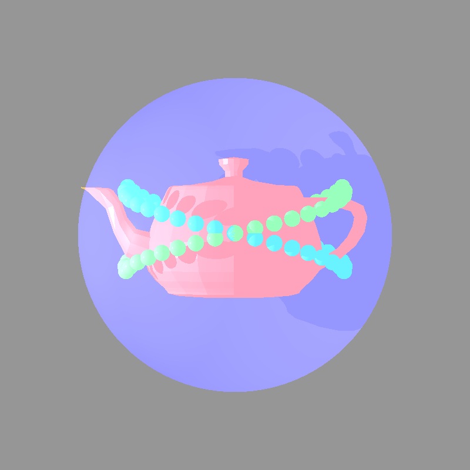

# RayRender3D

Render 3D models using Java and Ray Tracing (Phong Illumination Model).

Based on course ISE at JCT, 2024. (I added some new features after the course).

## Features
- Phong Illumination Model
- Transparencies and Reflections
- BVH and Threads-pool

## Screenshot

